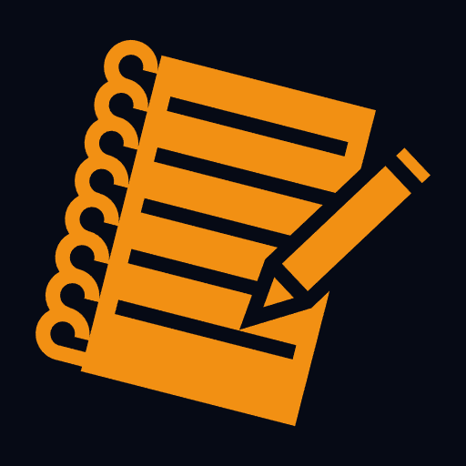

<div align="center">


# Master Mune

[](#-english) [](#-português-brasileiro)


</div>

---

<a name="-english"></a>
## 🇺🇸 English

**Mestre Mune** is a Progressive Web App (PWA) developed to facilitate Solo RPG sessions. Based on the **M.U.N.E. (Madey Upy Namey Emulator)** system, the tool centralizes the oracle, character sheet management, dice rolling, and notes into a modern, responsive, and highly customizable interface.

### ✨ Key Features

#### 🔮 Automated Oracle
- **Oracle Rolls:** Complete 6-answer system ("No, and...", "No", "No, but...", etc.) with "Normal", "Likely" (Advantage), and "Unlikely" (Disadvantage) options.
- **Automatic Interventions:** The system tracks intervention points (generated when rolling a '6'). Upon reaching 3 points, an Intervention is automatically triggered (Optional).
- **Plot & NPC Management:** Quick lists integrated into the oracle screen to dynamically add/remove narrative elements.

#### 👤 Character Management (Personas)
- **Full Sheets:** Create unlimited characters with images, archetypes, and descriptions.
- **Dynamic Resources:** Counters for Health, Mana, Ammo, Sanity, etc.
- **Flexible Attributes:** Define custom attributes (Strength, Agility, etc.), choose the roll formula (1d20, 3d6, etc.), and test type (Roll Under/Over, Roll Only).
- **Complex Rolls:** Click attributes to roll with modifiers and Advantage/Disadvantage.
- **Interactive Inventory:** Add items, mark as "Permanent/Equipment" or consumable, and define dice formulas for the item (e.g., `1d8+2` damage).

#### 🛠️ Collections & Tools
- **Roll Tables:** Create your own random tables or use the defaults.
- **Visual Omen:** Generate 3 random abstract icons (varied colors) to instantly inspire scenes and visual details using a list of 4000+ icons.
- **Customizable Decks:** Create card decks, draw cards, shuffle, and manage the discard pile.
- **Icon Selector:** A massive library of 4000+ icons (Game-Icons.Net) available to customize your collections and notes.
- **Persistence:** All custom collections are saved locally.

#### 📜 Session Journal (Log)
- **Automatic History:** All actions (oracle rolls, attribute tests, item usage) are automatically logged.
- **Manual Notes:** Add text notes or images to the log at any time. You can attach thematic icons to your notes.
- **Export:** - **PDF:** Print your formatted session.
  - **Markdown (.md)::** Export to use in Obsidian, Notion, or other text editors.

#### 🎨 Customization & Performance
- **Visual Themes:** Switch between themes like Default (Dark), Light (Paper/Journal), Fantasy, Sci-Fi, Cyberpunk, and Terminal.
- **Sound Effects:** Auditory feedback for dice rolls, cards, and interactions (can be disabled).
- **Backup & Restore:** Export all your data (Adventures and Collections) to a JSON file and restore on any device.
- **Optimization:** Lazy loading of icons to ensure instant application startup.

### 🚀 How to Run Locally

This project uses **Vite** and **React**.

1. **Clone the repository:**
   ```bash
   git clone [https://github.com/your-username/mestre-mune.git](https://github.com/your-username/mestre-mune.git)
   cd mestre-mune
   ```

2. **Install dependencies:**
   ```bash
   npm install
   ```

3. **Start the development server:**
   ```bash
   npm run dev
   ```

4. Access `http://localhost:5173` in your browser.

### 🛠️ Tech Stack
- **Core:** React 19, TypeScript
- **Build Tool:** Vite
- **Styling:** Tailwind CSS v4
- **Icons:** Lucide React & Game-Icons.Net (SVG)
- **Audio:** Howler.js / use-sound
- **Storage:** LocalStorage (Offline-first)

### 📄 Credits
- Based on the Solo RPG system **M.U.N.E.** (Madey Upy Namey Emulator). **[Link to original PDF](https://drive.google.com/file/d/1mJbHcCNscMfs_NPnqMMz2Y8KiD8gWrkZ/view).**
- Additional icons provided by **[Game-Icons.Net](https://game-icons.net/)** under [CC BY 3.0](https://creativecommons.org/licenses/by/3.0/) license.

--

<a name="-português-brasileiro"></a>

## 🇧🇷 Português (Brasileiro)

**Mestre Mune** é uma aplicação web progressiva (PWA) desenvolvida para facilitar sessões de RPG Solo. Baseada no sistema **M.U.N.E. (Madey Upy Namey Emulator)**, a ferramenta centraliza oráculo, gerenciamento de fichas, rolagens de dados e anotações em uma interface moderna, responsiva e altamente customizável.

### ✨ Funcionalidades Principais

#### 🔮 Oráculo Automatizado
- **Rolagens de Oráculo:** Sistema completo de 6 respostas ("Não, e...", "Não", "Não, mas...", etc) com opções de rolagem "Normal", "Provável" (Vantagem) e "Improvável" (Desvantagem).
- **Intervenções Automáticas:** O sistema rastreia os pontos de intervenção (gerados ao rolar um '6'). Ao atingir 3 pontos, uma Intervenção é disparada automaticamente (Opcional).
- **Gestão de Tramas & NPCs:** Listas rápidas integradas à tela do oráculo para adicionar/remover elementos da narrativa dinamicamente.

#### 👤 Gestão de Personagens (Personas)
- **Fichas Completas:** Crie personagens ilimitados com imagem, arquétipo e descrição.
- **Recursos Dinâmicos:** Contadores para Vida, Mana, Munição, Sanidade, etc.
- **Atributos Flexíveis:** Defina atributos customizados (Força, Agilidade, etc.), escolha a fórmula de rolagem (1d20, 3d6, etc.) e o tipo de teste (Rolar Abaixo/Acima, Apenas Rolar).
- **Rolagens Complexas:** Clique nos atributos para rolar com modificadores e Vantagem/Desvantagem.
- **Inventário Interativo:** Adicione itens, marque como "Permanentes/Equipamento" ou consumíveis, e defina fórmulas de dado para o item (ex: `1d8+2` de dano).

#### 🛠️ Coleções & Ferramentas
- **Tabelas de Rolagem:** Crie suas próprias tabelas aleatórias ou use as tabelas padrões.
- **Presságio Visual:** Gere 3 ícones abstratos aleatórios (com cores variadas) para inspirar cenas e detalhes visuais instantaneamente de uma lista de 4000+ ícones (Game-Icons.Net).
- **Baralhos Customizáveis:** Crie baralhos de cartas, saque cartas, embaralhe e gerencie o descarte.
- **Seletor de Ícones:** Uma biblioteca massiva de 4000+ ícones (Game-Icons.Net) disponível para customizar suas coleções e anotações.
- **Persistência:** Todas as coleções customizadas são salvas localmente.

#### 📜 Diário de Sessão (Log)
- **Histórico Automático:** Todas as ações (rolagens do oráculo, testes de atributo, uso de itens) são registradas automaticamente.
- **Notas Manuais:** Adicione anotações de texto ou imagens ao log a qualquer momento. Você pode anexar ícones temáticos às suas notas.
- **Exportação:** 
  - **PDF:** Imprima sua sessão formatada.
  - **Markdown (.md):** Exporte para usar no Obsidian, Notion ou outros editores de texto.

#### 🎨 Customização & Performance
- **Temas Visuais:** Alterne entre temas como Padrão (Dark), Claro (Paper/Journal), Fantasia, Sci-Fi, Cyberpunk e Terminal.
- **Efeitos Sonoros:** Feedback auditivo para rolagens de dados, cartas e interações (pode ser desativado).
- **Backup & Restore:** Exporte todos os seus dados (Aventuras e Coleções) para um arquivo JSON e restaure em qualquer dispositivo.
- **Otimização:** Carregamento "Lazy" de ícones para garantir inicialização instantânea da aplicação.

---

### 🚀 Como Rodar Localmente

Este projeto utiliza **Vite** e **React**.

1. **Clone o repositório:**
   ```bash
   git clone https://github.com/seu-usuario/mestre-mune.git
   cd mestre-mune
   ```

2. **Instale as dependências:**
   ```bash
   npm install
   ```

3. **Inicie o servidor de desenvolvimento:**
   ```bash
   npm run dev
   ```

4. Acesse `http://localhost:5173` no seu navegador.

---

### 🛠️ Tecnologias Utilizadas

- **Core:** React 19, TypeScript
- **Build Tool:** Vite
- **Estilização:** Tailwind CSS v4
- **Ícones:** Lucide React & Game-Icons.Net (SVG)
- **Áudio:** Howler.js / use-sound
- **Armazenamento:** LocalStorage (Offline-first)

---

### 📄 Créditos

- Baseado no sistema para RPG Solo **M.U.N.E.** (Madey Upy Namey Emulator). **[Link para o PDF Original](https://drive.google.com/file/d/1mJbHcCNscMfs_NPnqMMz2Y8KiD8gWrkZ/view).**
- Ícones adicionais fornecidos por **[Game-Icons.Net](https://game-icons.net/)** sob licença [CC BY 3.0](https://creativecommons.org/licenses/by/3.0/).


---


*Boas rolagens!* 🎲

Happy Rolling! 🎲 Boas rolagens!
